<i>Parts:</i> <a href="/2023/03/09/new-case-for-my-bitx40-radio/">1</a> <b>2</b>

Last time I had powered up the front panel to test the radio, and were just
about to try some power filter components to get rid of the "tuning clicks". I
experimented and found that the clicks went away with a 56 Ω series and 33 µF
parallel low pass filter added to the Raduino power input. I went with a 330 µF
capacitor to have some extra margin.

Next I soldered shielded cables to the volume knob, the audio out jack and the
and microphone in jack. The "mono" cable used for the jacks was quite nice to
work with. The "stereo" cable used for the volume knob was a bit bulky. I didn't
have a crimp tool for the Molex KK connectors used on the BITX main board, so I
soldered the wires into the pins (I had bought a lot of them). I continued with
a red-black twin cable for the power and a short run of RG316 coax for the VFO.

  
<a href="files/front_panel_wiring.jpg">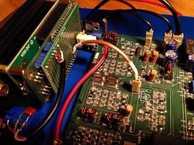</a>

  
Figure 1. Wiring of front panel power, audio, and VFO signals

## Back panel

While I was pondering where to put all the remaining wires onto the front panel
"interconnect board", I did some more practical stuff on the back panel. I made
a D-shaped hole for a nice bulkhead BNC connector I had salvaged from some junk.
It had a thin RG174-like piece of coax crimped onto it already, so I was happy
with having one less connection to do. I drilled a small hole and enlarged it
into the final D-shape using a file.

  
<a href="files/d-shaped_hole.jpg">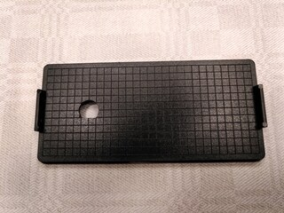</a>

  
Figure 2. D-shaped hole for female BNC bulkhead connector

The connector fit really well in the hole. When I took a photo and admired the
result, I saw that the connector looked a bit funny. It turned out I had used a
75 Ω BNC connector instead of a 50 Ω one!

  
<a href="files/installed_bnc.jpg">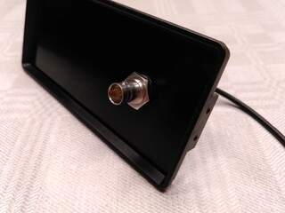</a>

  
Figure 3. 75 Ω BNC connector installed

The two variants actually fit together mechanically, but having a part of the
coax of the wrong impedance bothered me (even though it was only a few
centimeters). So I ordered some crimp connectors for the RG316 I had, as well as
a crimp die.

  
<a href="files/50_and_75_ohm_connectors.jpg">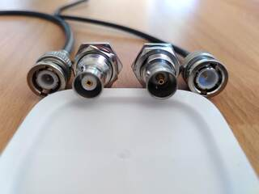</a>

  
Figure 4. 50 Ω BNCs (left) vs 75 Ω BNCs (right)

For power I had decided to use an Anderson Powerpole connector and a bayonet
style fuse holder. There seems to be few official panel mount options for
Powerpoles, so I asked a friend to 3D print [a nice panel mount][thingiverse] I
found on Thingiverse.

[thingiverse]: https://www.thingiverse.com/thing:5336886 "Powerpole mount for electric cooler by Nate B on Thingiverse"

I made two new holes for the Powerpole and the fuse holder. I made them without
any powertools, which actually made it easier to be accurate. (I don't own a
drill press.) With the 3D printed part the powerpole connector sits firmly in
place.

  
<a href="files/back_panel.jpg">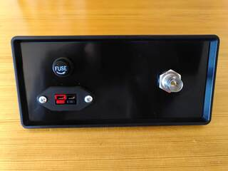</a>

  
Figure 5. Back panel connector

The battery power goes through the fuse and then to two improvised "bus bars"
made from copper clad board, super glued onto the inside of the back panel. I
used the bus bars to connect all the power wires together, as well as a chunky
schottky diode for reverse polarity protection. It's connected in the reverse
direction, so it only conducts when the power is connected with the wrong
polarity. The diode then causes a short circuit and blows the fuse, protecting
the rest of the circuit from negative voltage.

  
<a href="files/bus_bars.jpg">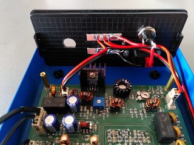</a>

  
Figure 6. Back panel "bus bars"

Later the new BNC connectors arrived. I practiced crimping by making my own
RG316 patch cable. I liked the result! I bought two-piece BNC connectors for
RG316 and RG58, as well as right-angle variants for both.

  
<a href="files/rg316_patch_cable.jpg">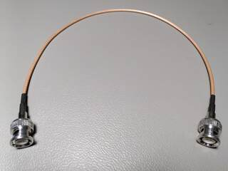</a>

  
Figure 7. RG316 patch cable (crimping practice)

Crimping the BNC bulkhead connector to a short run of RG316 and soldering a
Molex KK connector to it was the next step. It went smoothly too.

  
<a href="files/antenna_rg316_cable.jpg">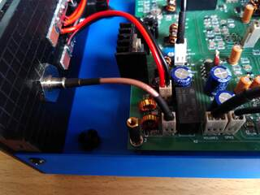</a>

  
Figure 8. Female BNC bulkhead connector crimped to RG316

## Main board mods

For the new case I wanted to use many of the Raduino mods, and some of them
required new cables to the main board. I started with the "PTT sense" mod, which
lets the Raduino sense the actual RX/TX state. I added a Molex KK connector to
the main board by gluing it on top of the corner of a potentiometer for
structure. I had to unsolder one of the electrolytic capacitors temporarily to
get my soldering iron into the right place. The connector pins were soldered
onto the ends of the C150 capacitor from above.

  
<a href="files/ptt_sense_connector.jpg">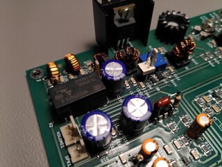</a>

  
Figure 9. PTT sense connector mod

The next mod was the CW carrier mod. It allows the Radiuno to inject a DC offset
into the mixer connected to the BFO. The DC offset causes the mixer to be
unbalanced, generating a carrier tone. I really looked forward to having this
mod! It comes handy when testing the transmitter and adjusting the matchbox for
the antenna.

I cut a small square of copper clad board, scored a notch in the copper to turn
it into two pads, glued the square to the main board and soldered a Molex KK
connector to it. Then I connected it through a 4.7 kΩ resistor to the C107
coupling capacitor next to the mixer.

  
<a href="files/cw_carrier_connector.jpg">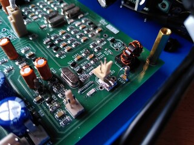</a>

  
Figure 10. CW carrier connector mod

## Front panel interconnect board

Next I continued working on the front panel interconnect board again. I ended up
adding a large square of copper clad board in the middle to connect the shields
of all the incoming cables. The PTT sense and PTT control nodes got their own
squares too. The PTT sense signal comes from the cable and goes to an input on
the Raduino and to the TX LED. The PTT control input of the main board can be
shorted to ground by the external PTT connector, the front panel PTT switch, and
by the Raduino through a 2N3904 transistor. The rest of the cables had their own
dedicated pins on the Raduino and required no extra connection pads.

  
<a href="files/front_panel_interconnect_board.jpg">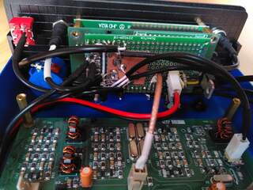</a>

  
Figure 11. Front panel interconnect board and associated mess wires

## Finished

After that, all wiring was done! The BITX40 is finally installed in its new
enclosure.

  
<a href="files/top_view_of_inside.jpg">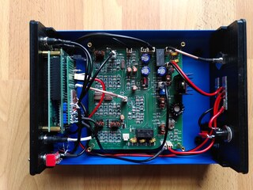</a>

  
Figure 12. Top view of the enclosure inside

I really like how this project turned out! I've decided to consider it done,
even though there's certainly things I would like to fix (labels, among other
things).

  
<a href="files/end_result.jpg">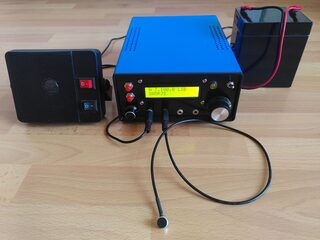</a>

  
Figure 13. End result: a working portable 40m rig

The picture above shows it powered on. I have tested most of the new features
and actually made my fourth contact with it. I really like how easy it is to use
my home made antenna tuner now that I have a simple way to make a full-power
test tone. The microphone I use is simply a cheap electret microphone on the end
of a short shielded cable. I have tried a computer headset too, but the signal
from its microphone had significatly lower amplitude when mounted in the headset
compared to directly connected to the radio. (I need to debug that issue more
properly.) I bought the speaker second hand online. I have a Bencher iambic
paddle that I want to try with the keyer in the Raduino, but I haven't gotten
around to make a 3.5 mm cable for it.

I have some ideas for what to do next:

* Add labels (white permanent marker? Dymo labels? toki pona hieroglyphs?)
* Add a power switch
* Try the CW mode more
* Operate from a park
* Make an EFHW antenna for the attic (I suspect my current one on the balcony is very lossy)
* Describe my ZM2-style antenna tuner
* Describe my dummy load with RF detector
* Experiment with building a directional coupler or SWR bridge
* Make a in-line voltage and current meter box with power poles, fuse and power switch

## Links

* [Topic on Groups.io for this blog post](https://groups.io/g/BITX20/topic/99798143)
